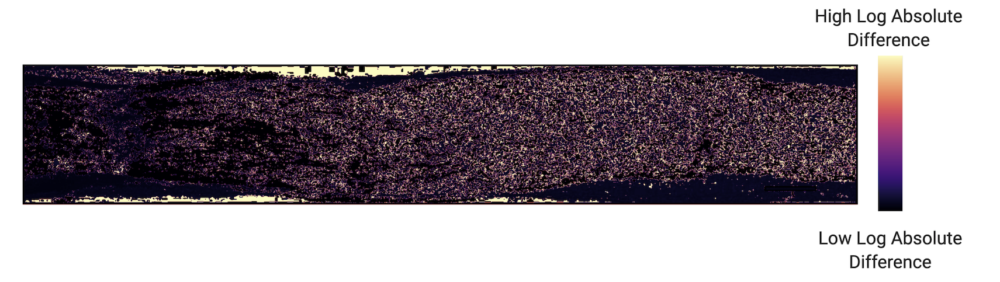

# Optic Nerve Regeneration Standardization

This code details how to approximate the regeneration by computing differences in optic nerve images and normalizing them. It presents a way to visualize and interpret where and how much regeneration is occurring.

The main notebook for generating this figure can be found in the `notebooks` folder. Just click the `Run in Colab` Button and have fun 😄. 

Make sure to just change the root and change the file names to match your images.
